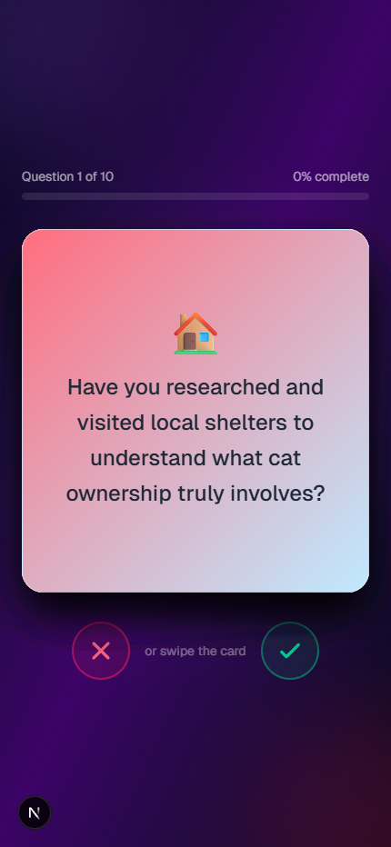
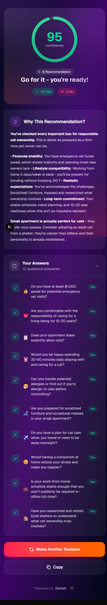

# Decidr

**Swipe Your Way to Clarity** — A Tinder-style AI decision helper that turns complex choices into simple swipes.


## What is Decidr?

Decidr combines Tinder-style UX with AI-powered insights to help you make decisions quickly and intuitively. Instead of overthinking, just swipe!

### How it works:

1. **Describe your dilemma** — provide context about your decision
2. **Swipe through 10 AI-generated questions** — right for yes, left for no
3. **Get instant clarity** — AI analyzes your gut responses and delivers a recommendation with a confidence score



## Features

- 🎯 **Tinder-style UX** — Reduces friction with natural swiping
- 🤖 **AI-personalized questions** — Covers emotional, practical, and long-term angles
- ⏱️ **Time-boxed interaction** — Forces quick gut responses over analysis paralysis
- 🎨 **Beautiful visual cards** — Each question has unique colors & emoji
- 📊 **Confidence scoring** — Shows how consistent your answers are



## Tech Stack

| Layer | Technology |
|-------|------------|
| **Frontend** | Next.js 16 + React 19 |
| **Swipe UX** | react-tinder-card |
| **AI Engine** | Claude Sonnet (via OpenRouter) |
| **Styling** | Tailwind CSS + Dynamic gradients |
| **State** | TanStack Query |

## Getting Started

First, install dependencies:

```bash
npm install
```

Create a `.env.local` file with your OpenRouter API key:

```bash
OPENROUTER_API_KEY=your_api_key_here
```

Then, run the development server:

```bash
npm run dev
```

Open [http://localhost:3000](http://localhost:3000) with your browser to see the result.

## License

MIT
